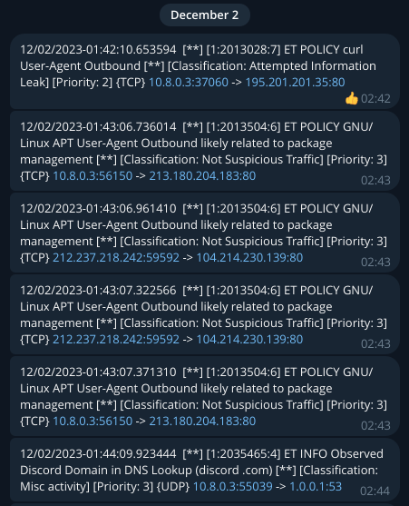
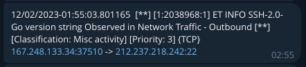
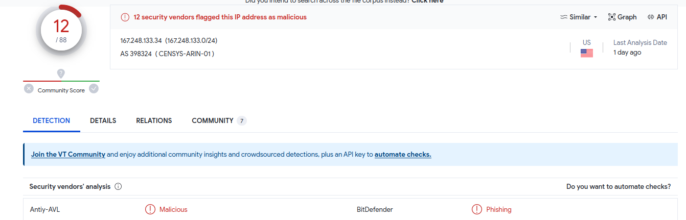

# suricata-telegram-notifier

The service for Suricata alerts notifying in Telegram. 
This service can help to get alerts faster in your Telegram account using **Telegram Bot API**. 





### Installation:
- copy `configs/service.ini.example` to `configs/service.ini`
- make changes in config by your own
- you also can change `configs/suricata.yaml`
- install as systemd service using next commands:
```bash
chmod +x install.sh
sudo ./install.sh
```

These steps will create systemd service:
- `/etc/systemd/system/suricata-telegram-notifier.service`

### Troubleshooting
- `systemctl status suricata-telegram-notifier` - check systemd service status
- `logs/service.log` - logs of suricata-telegram-notifier which similar to systemd status
- `logs/suricata.log` - logs of Suricata instance
- `logs/fast.log` - last alerts in readable format
