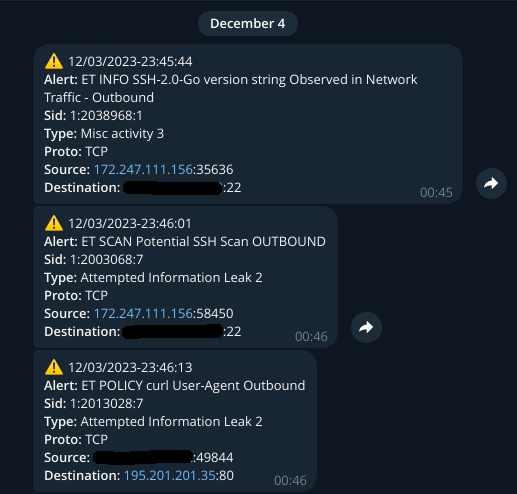
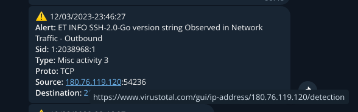
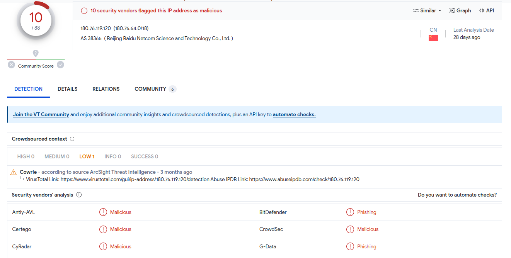
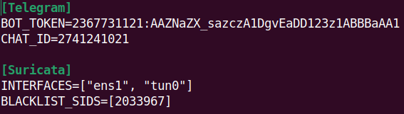

# suricata-telegram-notifier

This service for Suricata alerts to get notifications via Telegram Messenger. 
It can help to get alerts faster in your Telegram account using **Telegram Bot API**. It creates message with secure clickable IP-addresses that can be checked via **VirusTotal**.





This service requires root rights to run Suricata in system mode. It can work as systemd service or can work as native.
### Installation:
- copy `configs/service.ini.example` to `configs/service.ini`
- make changes in config by your own



Create Telegram Bot and get `BOT_TOKEN` using [BotFather](https://t.me/BotFather). Then get your Telegram User ID using [myidbot](https://t.me/myidbot). Specify interface that you would like monitor. You can specify multiply interfaces. To mute alert of specific rule (if you have messages spamming) you can specify sid or sids in `BLACKLISTS_SIDS`. For example you should mute sid `2033967`, `ET Telegram API Domain TLS SNI` or you will get many messages with alerts
- you also can change `configs/suricata.yaml`
- install as systemd service using next commands:

```bash
chmod +x install.sh
sudo ./install.sh
```

These steps will create systemd service:
- `/etc/systemd/system/suricata-telegram-notifier.service`


### Troubleshooting
- `systemctl status suricata-telegram-notifier` - check systemd service status
- `logs/service.log` - logs of suricata-telegram-notifier which similar to systemd status
- `logs/suricata.log` - logs of Suricata instance
- `logs/fast.log` - last alerts in readable format

### TODO
- [ ] add last alert checking to prevent spam